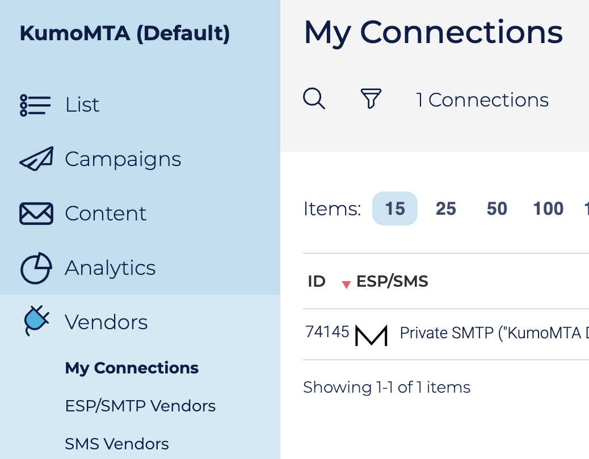

# Ongage SMTP integration  

## Introduction

[Ongage](https://www.ongage.com/) is an email marketing platform that allows you to create and manage content and campaigns then deliver them through your favourite sending engine. This integration describes how to use KumoMTA as the delivery engine for Ongage.

## Instructions

### Get KumoMTA 

 1) Install KumoMTA as per the installation instructions here  
https://docs.kumomta.com/userguide/installation/overview/ 

Before finishing this step, you should ensure that you have correctly set up DNS with a resolving sending domain, MX, PTR, SPF, DKIM, etc.   

As part of this process, you will be creating a DNS entry for “bounce.<yoursendingdomain>”, as well as similar tracking and image domains so be prepared to edit your DNS. 

 2) Ensure that you can inject mail using SMTP_Auth (Plain) with TLS. Remember to add the access credentials and test it.   https://docs.kumomta.com/userguide/operation/smtpinjection/?h=smtp_auth 

   **NOTE**: TLS is crucial to this process, so ensure you have a valid and tested certificate attached to your listener config. https://docs.kumomta.com/reference/kumo/start_esmtp_listener/#tls_certificate  

### Get Ongage 

 3) Go to Ongage.com and create an account https://www.ongage.com/registration 

 4) Create a support ticket to request access to use the “Private SMTP” connector and let them know you are using KumoMTA as the sending MTA. 

Here is some essential reading before you set up the Private SMTP connector: 
https://ongage.atlassian.net/wiki/spaces/HELP/pages/657817611/The+Ongage+Private+SMTP+Connector  

 5) Once registered, you can add a vendor by selecting Vendors > My Connections in the left menu 

 

 6) Create a new connection and add “Private SMTP” as the connection type.  
**NOTE**: If you do not see this as an option, jump back up to step 4 and ask Ongage Support to add it for you. 

 7) Fill in all the required fields and test. 

* You can choose any username and password you like, KumoMTA has no preset or preference.  These credentials should match what you set in step 2. 
* Select PLAIN authentication Type 
* Select YES for “Use TLS” 
* The SMTP Port should match what your listener is listening on.  Remember to update your public firewall too.  

If you have done everything right, you will see a positive notification that credentials were verified. 

 8) Pat yourself on the back then start using Ongage with KumoMTA 

 

 

 

 
